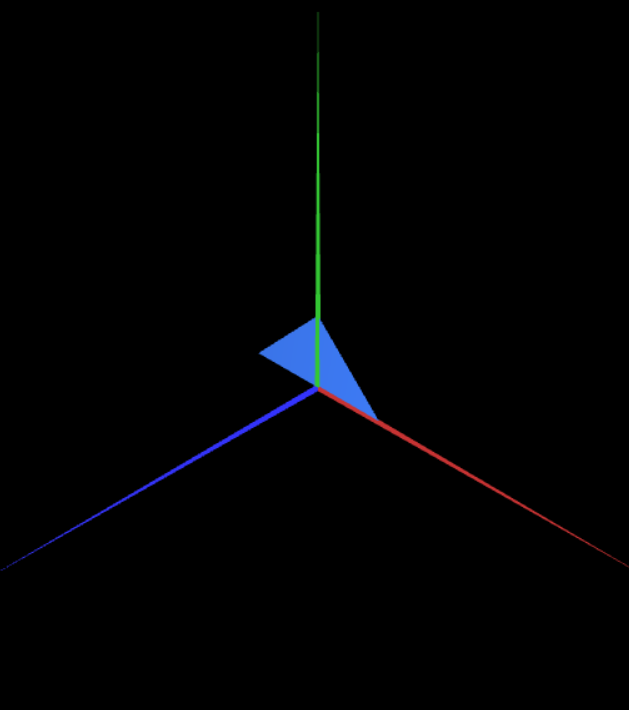
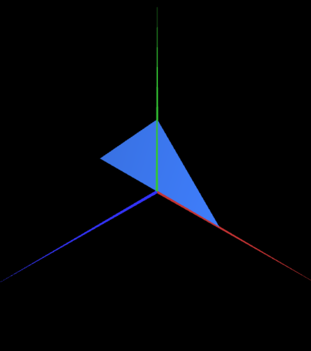

# CG 2022/2023

## Group T01G02

## TP 1 Notes

- In exercise 1, to make the parallelogram double-sided, we observed that we only needed to add the indices in clock-wise order along side with the counter-cock-wise indices.
- In exercise 2, we observed that the big triangle could be achieved by using the smaller triangle with a scale factor of 2.
- In exercise 1, at first, we assumed that the Z axis was the green one, but then we were corrected.

