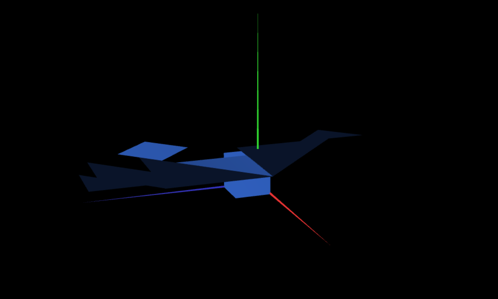

# CG 2022/2023

## Group T01G02

## TP 2 Notes

- In the tangram, the different shapes have different brightness depending on their position and the cameras point of view.
- In exercise 3, we had to first visualize the cube and draw it, in order to better understand its position and vertice coordinates.
- In exercise 4, we noted that we only need one Square object to create the cube's 6 faces.

